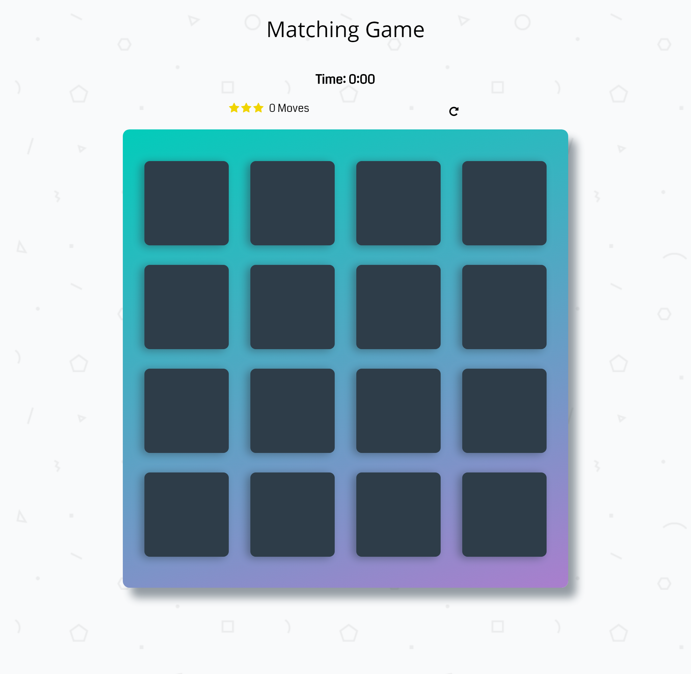
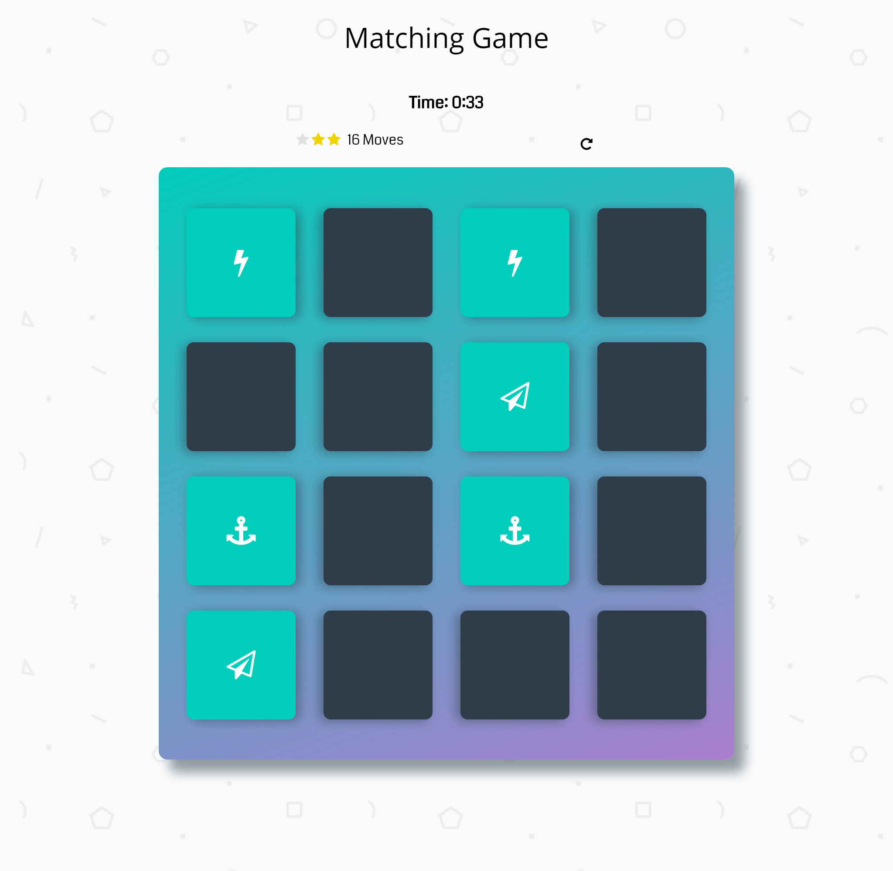
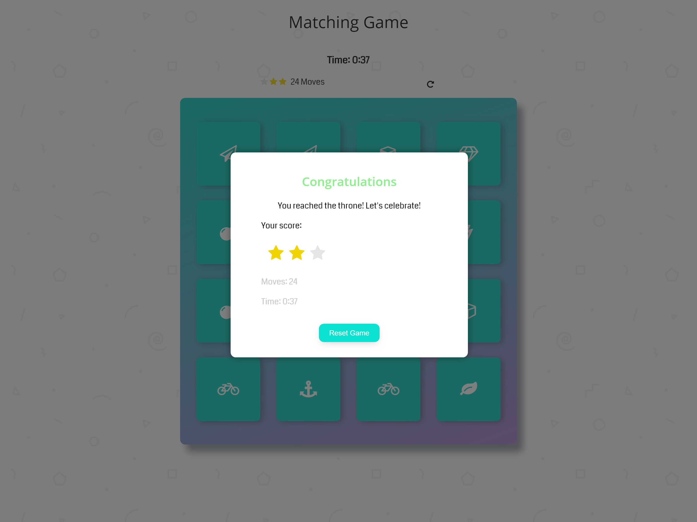

# Memory Game Project

## Table of Contents

* [Project Purpose](#project-purpose)
* [How to Load the Game](#how-to-load-the-game)
* [How to Play the Game](#how-to-load-the-game)
* [Screenshots](#screenshots)
* [Resources used to create the game](#resources-used-to-create-the-game)

## Project Purpose:

This game was built as a Udacity Course project. The purpose of the project is to demonstrate mastery of HTML, CSS, and JavaScript.

## How to Load the game

- Clone the [repo](https://github.com/sidneypp/jogo-da-memoria.git). and open index.html -- or --
- Play on GitHub.io: [Memory Game](https://sidneypp.github.io/memory-game/)

### How to Play the Game

The game board consists of sixteen cards randomly arranged in a grid. The deck is made up of eight pairs of cards, each with different symbols on one side.

On each turn:

- The player flips one card over to reveal its underlying symbol
- The player then turns over a second card, trying to find the corresponding card with the same symbol
- If the cards match, both cards stay flipped over
- If the cards do not match, both cards are returned to their initial hidden state
- The game ends once all cards have been correctly matched.

### Screenshots

 

## Resources used to create the game:

### Array shuffle:

- http://stackoverflow.com/a/2450976>

### Card Flipping CSS:

- <https://davidwalsh.name/css-flip>
- <http://callmenick.com/post/css-transitions-transforms-animations-flipping-card>

### Timer

- <https://www.w3schools.com/howto/howto_js_countdown.asp>

### Modal

- <https://www.w3schools.com/howto/howto_css_modals.asp>

### Font Awesome

- <https://maxcdn.bootstrapcdn.com/font-awesome/4.6.1/css/font-awesome.min.css>

### Font Coda

- <https://fonts.googleapis.com/css?family=Coda>

#### Udacity Resources:

- [Project Rubric](https://review.udacity.com/#!/rubrics/591/view)
- [Project Initial Code](https://github.com/udacity/fend-project-memory-game)
